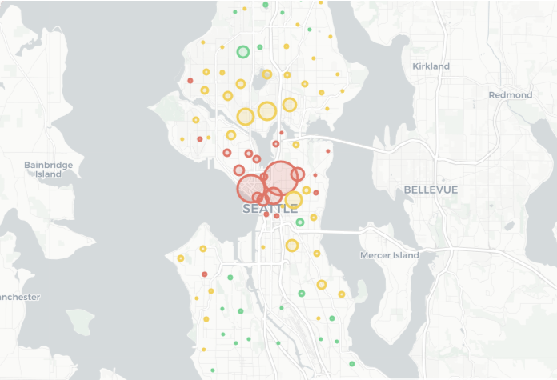
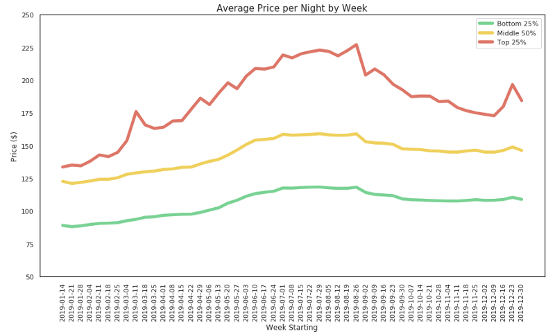
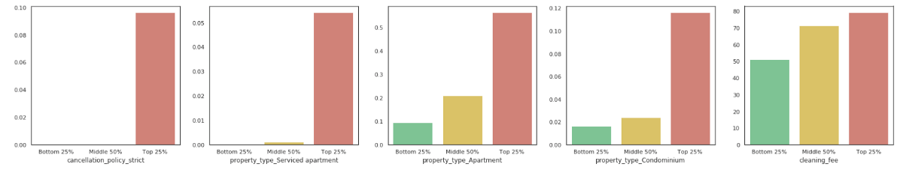

# Udacity Data Science Nanodegree - Write A Data Science Blog Post

This project will take a look at AirBnb's seattle listing data in 2019, answering three questions related to the listings's price:

1. How does Seattle listings' price vary with area? 
2. How does Seattle listings' price vary with time? 
3. What other factors can predict that a particular listing is in an expensive area? 

This repository is posted in: 

https://medium.com/@aldistefanusfelim/exploring-seattle-airbnb-listings-where-when-and-why-ef7cd3bf6dc

# Datasource

All the data used in this project can be found in the ./data/seattle folder.

The datas are owned by AirBnb, and can be obtained at http://insideairbnb.com/get-the-data.html

# Dependencies

External packages used in this notebook: 

1. pandas
2. numpy
3. matplotlib
4. seaborn
5. sklearn
6. folium

# The Data

The data contained in the ./data/seattle are in their compressed form, as GitHub will not allow uploading large files.

They will need to be unzipped first, either manually or using the linux command gunzip {file_name}

There are two data files that will be used in this analysis: 

1. listings.csv - This .csv file contains the ~8k Seattle AirBnb listings as of Jan 2019
2. calendar.csv - This .csv file contains the availability and price set for the rest of the year on a daily level per listing, there will be 365 * (total_listings) rows

# Summary on Analysis Results

### 1. Price Variation Across Areas

Average prices and number of listings in each neighbourhood is obtained and visualized. 

    -Red -> Top 25% most expensive neighbourhoods
    -Yellow -> Middle 50%
    -Green -> Bottom 25%

Bubble size indicates relative number of listings across neighbourhoods. 

Most expensive neighbourhood : South Lake Union ($89.8 /night/person)

Least expensive neighbourhood : Pinehurst ($24.8 /night/person)

The results from this step are provided in this repository: 
    - neighbourhood_data.csv - contains all aggregated neighbourhood level data (mean price, latitude, longitude, # listings, etc)
    - seattle_listings_map.html - folium html export containing the visualisation in the screenshot above

### 2. Price Variation Across Time

Average price across weeks is visualised for the three different price buckets. Key insights: 

1. Price peaks from July to mid September - consistent with suggestions from travel websites 
2. More expensive listings exhibits more price variations with respect of time of year. Weekly spikes (eg. Christmas) is also observed

### 3. Other Features Predicting A Listing Is From Top 25% Price Neighbourhoods

For this last part, LogisticRegression is ran on several numerical and categorical features (other than neighbourhood of the listing) to find what other signals can predict that the listing originates from a more expensive area. 

The model performs quite well in predicting the Top 25% Price class. 
Features having top 5 highest coefficients in the Logit is then obtained, and their mean is visualized across groups to interpret how does listings in the more expensive area differ.

Listings in the Top 25% Price group have: 
    
1. Stricter cancellation policy
2. Higher percentage of serviced apartments, apartments and condominiums
3. More expensive cleaning fee 

# Acknowledgments 

1. Udacity - for opportunity to complete this very interesting project
2. AirBnb - for providing the data and reliable accommodations everywhere! :)
